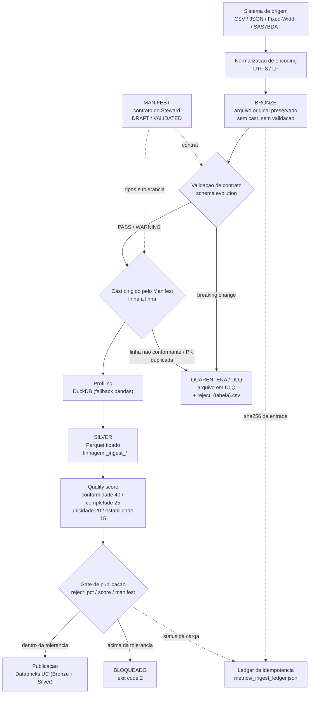
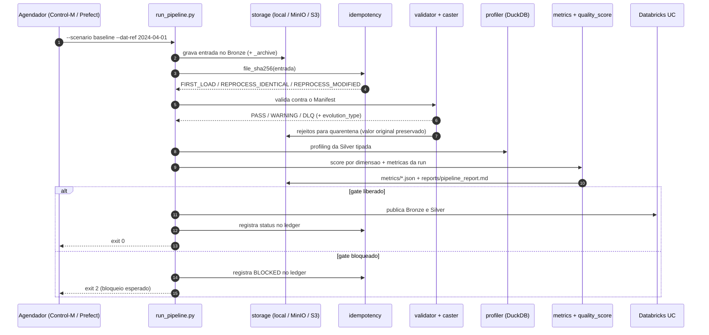
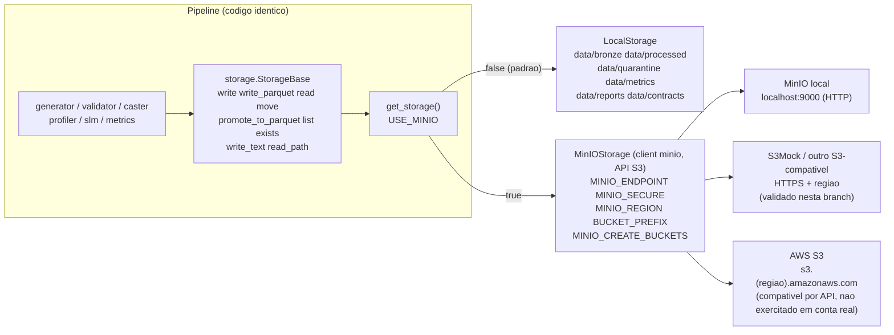
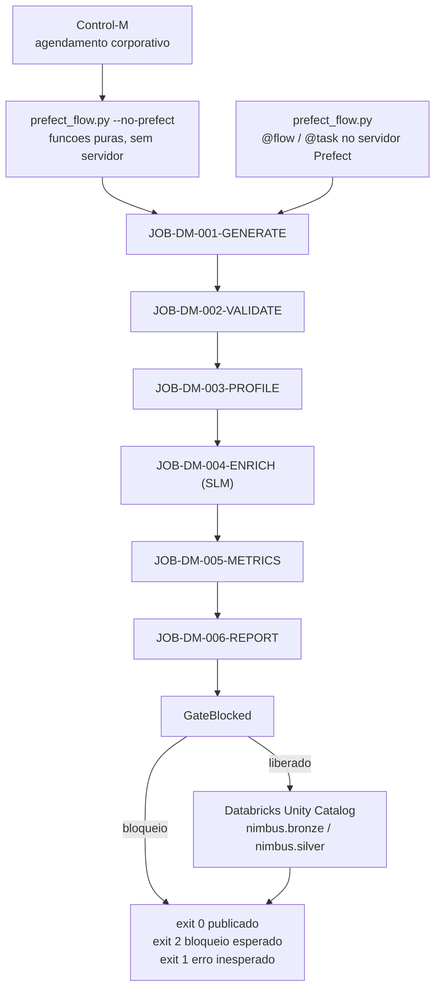
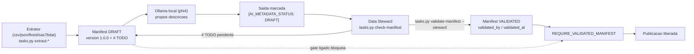
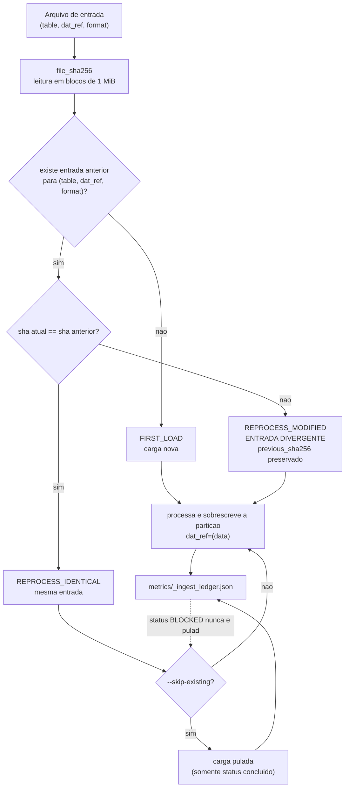

# Projeto Nimbus

Pipeline de dados bancaria com arquitetura medallion, contratos de dados extensiveis (Manifest),
tipagem governada por contrato, quarentena rastreavel, score de qualidade, idempotencia por
`dat_ref` + SHA-256 do arquivo de entrada, storage portavel (filesystem, MinIO, S3) e documentacao
semantica gerada por IA local com revisao humana obrigatoria.

O objetivo do projeto e resolver uma dor concreta: a distancia entre o time de negocio e o time
tecnico na hora de entender o que um dado significa, e a falta de rastreabilidade de por que uma
carga foi aceita, rejeitada ou reprocessada.

**Escopo honesto.** Esta e uma PoC single-node em pandas. O valor esta em contrato, governanca,
roteamento de rejeitos, linhagem, observabilidade e portabilidade de storage — nao em escala.
Os limites conhecidos estao no [§10](#10-limites-conhecidos), declarados de proposito.

---

## 1. A ideia central

O **Manifest** e um arquivo YAML que vai além do schema tecnico. Descreve de onde o dado vem, qual
regulacao se aplica, o que cada coluna significa no negocio bancario e exemplos de uso. E o ponto
de partida para tudo que o pipeline faz: tipagem, validacao, tolerancia de rejeito, tags de
governanca e o prompt da SLM.

A **SLM** roda localmente via Ollama e, depois da validacao e do profiling, le o Manifest junto com
as estatisticas reais e escreve documentacao tecnica em linguagem de negocio. Ela parte sempre do
que o Data Steward declarou e o resultado nasce marcado `[AI_METADATA_STATUS: DRAFT]` — a SLM
propoe, nao decide.

O **Data Steward** fecha o ciclo. Toda documentacao gerada por IA nasce `DRAFT`; so depois de
revisao humana avanca para `VALIDATED`.

O **Silver** grava Parquet com os tipos declarados no Manifest — nao os inferidos pelo PyArrow.
Uma coluna `fl_ativo: boolean` chega ao Silver como `pa.bool_()` porque o Steward disse que e
boolean. O footer do arquivo indica se o schema veio de Manifest `VALIDATED` ou `DRAFT`.

O **Bronze** preserva a entrada como ela chegou (`_archive/`), sem cast e sem validacao — o que
permite reprocessar a partir da origem e provar o que foi recebido.

O **Databricks** recebe duas camadas via Files API (Unity Catalog Volumes): Bronze com o arquivo
bruto (colunas STRING + provenance) e Silver com o Parquet tipado registrado como managed Delta
table, com tags de governanca (LGPD, SCR) vindas do Manifest.

---

## 2. Arquitetura

### 2.1 Fluxo medallion



### 2.2 Sequencia de uma carga (ingestao, validacao e gate)



### 2.3 Topologia de storage (local, MinIO, S3)



### 2.4 Orquestracao: Prefect, Control-M e Databricks



### 2.5 SLM com revisao humana



### 2.6 Reprocessamento e SHA-256



---

## 3. Estrutura do projeto

```
nimbus/
|-- README.md
|-- tasks.py                  Runner cross-platform (Windows, Mac, Linux)
|-- Makefile                  Atalhos via make (Mac/Linux/WSL)
|-- Dockerfile                Imagem Docker do pipeline
|-- docker-compose.yml        Pipeline + Ollama + MinIO
|-- .env.example              Template de configuracao
|-- config.py                 Le todas as configs via variaveis de ambiente
|-- run_pipeline.py           Execucao direta
|-- prefect_flow.py           Orquestracao Prefect mapeada para Control-M
|-- show_metrics.py           Dashboard no terminal
|-- queries_apresentacao.sql  Consultas DuckDB e Databricks SQL de demonstracao
|
|-- docs/
|   |-- ARCHITECTURE.md       Arquitetura tecnica e integracao Databricks
|   |-- STORAGE_S3.md         Storage portavel: local, MinIO, S3 e AWS
|   |-- MANIFEST.md           Estrutura do contrato e papel do Data Steward
|   |-- SLM.md                Como o modelo de IA se encaixa no fluxo
|   |-- TESTING.md            Cobertura de testes e criterios de aceite
|   |-- CHANGELOG.md          Historico de evolucao por sprint
|   |-- NEXT_STEPS.md         Pendencias e planejamento
|   `-- MIGRATION_PLAN.md     Plano de migracao para Azure Databricks
|
|-- scripts/
|   `-- entrypoint.sh         Orquestra inicializacao do container
|
|-- src/
|   |-- generators/           Dados ficticios deterministicos (CSV, JSON, Fixed-Width)
|   |-- ingestion/            Normalizacao de encoding + idempotencia (SHA-256 e ledger)
|   |-- manifest/             Extratores automaticos e validacao HITL
|   |-- storage/              Abstracoes medallion + Parquet governado pelo Manifest
|   |-- validation/           Contratos, cast dirigido e schema evolution
|   |-- profiler/             Profiling via DuckDB
|   |-- slm/                  Integracao com Ollama
|   |-- metrics/              Metricas, quality score e relatorios
|   `-- connectors/           Integracao Databricks via Files API + Unity Catalog
|
|-- tests/                    592 testes unitarios
`-- data/                     Camadas medallion (persiste no host via Docker volume)
```

O Manifest e o contrato soberano: cada coluna e convertida para o tipo declarado e cada linha que
nao converte e rejeitada individualmente, com o valor original preservado em
`data/quarantine/reject_<tabela>.csv` junto de `_reject_columns`, `_reject_values` e
`_reject_reason`. Duplicatas de chave primaria seguem o mesmo caminho (`DUPLICATE_PK`): a primeira
ocorrencia e mantida, as repeticoes vao para a quarentena. O percentual rejeitado e comparado com
`tolerance.max_reject_pct` do Manifest — dentro do limite a tabela publica com
`PASS_WITH_REJECTS`, acima do limite a publicacao e **bloqueada** e a execucao sai com exit code 2.

---

## 4. Inicio rapido

### Com Docker (recomendado)

```bash
cp .env.example .env
# Evita timeout do Ollama na primeira execucao:
docker run --rm -v ollama_models:/root/.ollama ollama/ollama pull phi4
docker compose up --build
```

Prefect UI: `http://localhost:4200` | MinIO UI: `http://localhost:9001`

```bash
docker compose exec nimbus python tasks.py metrics
docker compose exec nimbus python tasks.py upload-bronze
docker compose exec nimbus python tasks.py upload-silver
```

### Sem Docker

```bash
pip install -r requirements.txt
python tasks.py baseline
python tasks.py metrics
```

---

## 5. Configuracao

O unico arquivo que o usuario precisa editar e o `.env`. O `config.py` le tudo via variaveis de
ambiente — em Docker elas vem do `docker-compose.yml`, localmente vem do `.env`.

| Variavel | Padrao | O que controla |
|---|---|---|
| `OLLAMA_MODEL` | `phi4` | Modelo baixado automaticamente no primeiro boot |
| `SKIP_SLM` | `false` | Desativa enriquecimento semantico |
| `DAT_REF` | (vazio) | Data de referencia da carga (`YYYY-MM-DD`); vazio = data do `run_id` |
| `STRICT_TYPING` | `true` | Cast obrigatorio pelos tipos do Manifest |
| `QUALITY_GATE` | `false` | Bloqueia publicacao de tabela reprovada no score |
| `REQUIRE_VALIDATED_MANIFEST` | `false` | Gate de governanca: exige Manifest VALIDATED para publicar |
| `USE_MINIO` | `false` | Troca o filesystem local pelo object storage S3-compativel |
| `MINIO_ENDPOINT` | `localhost:9000` | Endpoint do object storage (`host:porta`, sem esquema) |
| `MINIO_ACCESS_KEY` | (vazio, **obrigatoria** com `USE_MINIO=true`) | Access key; sem default no codigo |
| `MINIO_SECRET_KEY` | (vazio, **obrigatoria** com `USE_MINIO=true`) | Secret key; sem default no codigo |
| `MINIO_SECURE` | `false` | `true` liga HTTPS/TLS (obrigatorio em S3 gerenciado) |
| `MINIO_REGION` | (vazio) | Regiao usada na assinatura SigV4 (ex.: `sa-east-1`) |
| `BUCKET_PREFIX` | `nimbus` | Prefixo dos buckets (`<prefixo>-bronze`, `<prefixo>-silver`, ...) |
| `MINIO_CREATE_BUCKETS` | `true` | `false` impede o pipeline de criar bucket em conta gerenciada |
| `DATABRICKS_HOST` | (vazio) | URL do workspace |
| `DATABRICKS_TOKEN` | (vazio) | PAT ou vazio para OAuth |
| `DATABRICKS_WAREHOUSE_ID` | (vazio) | SQL Editor > nome do warehouse > copy ID |
| `DATABRICKS_CATALOG` | `nimbus` | Catalog UC |
| `DATABRICKS_SILVER_SCHEMA` | `silver` | Schema das tabelas Silver |
| `DATABRICKS_BRONZE_SCHEMA` | `bronze` | Schema das tabelas Bronze |
| `DATABRICKS_VOLUME` | `landing` | Volume UC do Silver |
| `DATABRICKS_BRONZE_VOLUME` | `landing` | Volume UC do Bronze |
| `DATABRICKS_AUTO_UPLOAD` | `true` | Publica Silver apos cada run |
| `DATABRICKS_BRONZE_UPLOAD` | `true` | Publica o arquivo bruto apos a geracao |
| `DATABRICKS_QUARANTINE_UPLOAD` | `false` | Publica rejeitos e arquivos em DLQ da quarentena; desligada por padrao porque rejeito carrega o registro que falhou |
| `QUARANTINE_MASK_PII` | `true` | Mascara, nos rejeitos, as colunas marcadas `LGPD_SENSITIVE` no Manifest |
| `QUARANTINE_BLOCKED_SILVER` | `true` | Carga reprovada no gate sai da Silver e fica na quarentena |

---

## 6. Storage portavel: local, MinIO e S3

O pipeline nunca sabe onde o dado reside. Todos os modulos falam com `StorageBase`
(`write`, `write_parquet`, `read`, `move`, `promote_to_parquet`, `list`, `exists`, `write_text`,
`read_path`) e `get_storage()` escolhe o backend em tempo de execucao. Trocar de filesystem para
object storage **nao altera uma linha de codigo do pipeline** — so variaveis de ambiente.

Buckets (com `BUCKET_PREFIX=nimbus`): `nimbus-bronze`, `nimbus-silver`, `nimbus-quarantine`,
`nimbus-contracts`, `nimbus-metrics`, `nimbus-reports`. Metricas e relatorios vao para o mesmo
backend do dado — governanca nao fica presa no disco local.

### 6.1 Filesystem local (padrao)

```bash
python run_pipeline.py --scenario baseline --format csv
python show_metrics.py --score
```

### 6.2 MinIO local (um comando)

```bash
make demo            # ou: python tasks.py demo
```

`demo` gera o `.env` com credencial aleatoria na primeira execucao (nas seguintes reaproveita a
que ja existe), sobe o MinIO, aguarda o health check, cria os buckets e roda
`run_pipeline.py --scenario baseline --format json` + `show_metrics.py --score` **contra o
object storage**, sem exigir nenhum `export` no seu shell.

Para so subir o ambiente e depois trabalhar na mao:

```bash
make up                                      # ou: python scripts/nimbus_up.py
make minio-creds                             # console/usuario/senha do MinIO local
eval "$(python scripts/nimbus_up.py --print-env)"   # bash/zsh: exporta no shell atual
python run_pipeline.py --scenario baseline --format json
```

A credencial nunca aparece em codigo nem em log: fica so no `.env`, que esta no `.gitignore`
(`make minio-creds` e a forma explicita de consultar). `make down` derruba os containers
preservando dados e credencial; `make reset-minio` recria o volume do zero.

### 6.3 Outro servidor S3-compativel, com TLS e regiao

Exemplo exercitado nesta branch (Adobe S3Mock, sem MinIO envolvido), so por env var:

```bash
export USE_MINIO=true
export MINIO_ENDPOINT=localhost:9191        # host:porta, sem https://
export MINIO_SECURE=true                    # TLS
export MINIO_REGION=us-east-1               # SigV4
export BUCKET_PREFIX=nimbus-demo            # evita colisao de nome
export MINIO_ACCESS_KEY=dummy
export MINIO_SECRET_KEY=dummy
python run_pipeline.py --scenario baseline --format csv
```

### 6.4 AWS S3

O cliente `minio` fala a API S3, portanto a configuracao e a mesma — muda o endpoint, a regiao e
as credenciais:

```bash
export USE_MINIO=true
export MINIO_ENDPOINT=s3.sa-east-1.amazonaws.com
export MINIO_SECURE=true
export MINIO_REGION=sa-east-1
export BUCKET_PREFIX=nimbus-<sufixo-unico>   # nome de bucket em S3 e global
export MINIO_CREATE_BUCKETS=false            # buckets criados por IaC/plataforma
export MINIO_ACCESS_KEY=<AWS_ACCESS_KEY_ID>
export MINIO_SECRET_KEY=<AWS_SECRET_ACCESS_KEY>
python run_pipeline.py --scenario baseline --format csv
```

Pontos de atencao, na ordem em que aparecem:

1. **HTTPS e obrigatorio.** Sem `MINIO_SECURE=true` o cliente recusa a combinacao host/porta
   (`This combination of host and port requires TLS`).
2. **Regiao e obrigatoria** para a assinatura SigV4 do endpoint regional.
3. **Nome de bucket em S3 e global.** `nimbus-bronze` provavelmente ja existe na conta de alguem;
   use `BUCKET_PREFIX` proprio.
4. **`MINIO_CREATE_BUCKETS=false`** em nuvem: a criacao de bucket passa a ser responsabilidade da
   plataforma, e o pipeline falha rapido se o bucket nao existir, em vez de criar recurso sozinho.
5. **Credencial.** Em conta real, use credencial de servico de escopo minimo e nunca a coloque em
   `.env` de maquina de demonstracao.

**Status de evidencia (leia antes de afirmar em apresentacao):** compatibilidade com a API S3,
TLS, regiao e prefixo foram exercitados com MinIO e com um segundo servidor S3-compativel. Uma
conta AWS real **nao** foi exercitada — o que falta e conta, IAM, nome unico e custo; nao e
codigo. Detalhes em [docs/STORAGE_S3.md](docs/STORAGE_S3.md).

---

## 7. Idempotencia, SHA-256 e reprocessamento

A identidade logica de uma carga e `(tabela, dat_ref, formato)` — nao o `run_id`. O `run_id` muda
a cada execucao e serve para rastreio; a `dat_ref` identifica a janela de dados. Reprocessar a
mesma `dat_ref` sobrescreve a particao correspondente (Silver local e
`dat_ref=<data>/part-<data>.parquet` no Volume) em vez de acumular duplicata, e a linhagem registra
`_ingest_dat_ref` ao lado de `_ingest_run_id`.

Alem da `dat_ref`, o pipeline calcula o **SHA-256 do arquivo de entrada** (leitura em blocos de
1 MiB, sem carregar o arquivo na memoria) e guarda no ledger. Isso separa dois casos que antes eram
indistinguiveis:

| Situacao | Estado no ledger | Comportamento |
|---|---|---|
| Primeira carga de `(tabela, dat_ref, formato)` | `FIRST_LOAD` | processa normalmente |
| Mesma `dat_ref`, arquivo byte a byte igual | `REPROCESS_IDENTICAL` | declara reprocessamento e sobrescreve a particao; `--skip-existing` pode pular |
| Mesma `dat_ref`, arquivo diferente | `REPROCESS_MODIFIED` | loga `ENTRADA DIVERGENTE` com `sha anterior -> sha atual`, guarda `previous_sha256` e **ignora** `--skip-existing` |

O ledger fica em `metrics/_ingest_ledger.json`, gravado pelo storage configurado (mesmo
comportamento em filesystem local e MinIO/S3), com uma entrada por `(tabela, dat_ref, formato)`
contendo `input_file`, `input_sha256`, `previous_sha256`, `input_situation`, `reprocess_count`,
`status`, `rows`, `run_id`, `dat_ref` e `format`. Carga bloqueada por gate/DLQ fica registrada como
`BLOCKED` e por isso **nao** e pulada por `--skip-existing`. Cargas antigas, gravadas antes do
hash existir, sao tratadas como identicas por compatibilidade.

```bash
python run_pipeline.py --scenario baseline --dat-ref 2024-04-01                   # FIRST_LOAD
python run_pipeline.py --scenario baseline --dat-ref 2024-04-01                   # REPROCESS_IDENTICAL
python run_pipeline.py --scenario baseline --dat-ref 2024-04-01 --skip-existing   # pula
python run_pipeline.py --scenario type_drift --dat-ref 2024-04-01 --skip-existing # REPROCESS_MODIFIED: nao pula
```

Saida real da segunda execucao:

```
[IDEMPOTENCIA] input sha256=c5f63b648865 (tb_clientes.csv)
[IDEMPOTENCIA] reprocessamento de tb_clientes dat_ref=2024-04-01 (run ..., status PASS,
               arquivo identico sha c5f63b648865) - a particao sera sobrescrita
```

E do caso divergente:

```
[IDEMPOTENCIA] ENTRADA DIVERGENTE em tb_clientes dat_ref=2024-04-01: arquivo difere da carga
               anterior - sha c5f63b648865 -> 0192aa906a15
[IDEMPOTENCIA] --skip-existing ignorado: o conteudo mudou, a particao precisa ser reprocessada
```

Para que o caso "identico" seja demonstravel, a **geracao de dados ficticios e deterministica**
quando `--dat-ref` e informada: a semente vem de `SHA-256(scenario|format|dat_ref)` e semeia
`random`, NumPy, Faker e a geracao de UUID. Sem `--dat-ref`, a geracao permanece aleatoria.
O `prefect_flow.py` aceita `--dat-ref` com a mesma semantica (sem `--skip-existing`).

---

## 8. Exit codes

O mesmo contrato vale para `run_pipeline.py`, `prefect_flow.py` e o container — e e o que o
agendador usa para rotear:

| Codigo | Significado | Acao do agendador |
|---|---|---|
| `0` | Execucao concluida e Silver publicada | Segue o fluxo normal |
| `2` | Publicacao bloqueada por gate de qualidade, governanca ou quarentena/DLQ | Resultado esperado: roteia para o fluxo de tratamento, nao aciona plantao |
| `1` | Erro inesperado de execucao | Falha real: aciona plantao |

Os cenarios `breaking` e `type_drift` terminam em `2` **por desenho** — e a gate funcionando, nao
uma falha de pipeline. No Prefect, o bloqueio levanta `GateBlocked`, de modo que a run aparece como
**Failed** na UI/worker em vez de "Completed" silencioso. O modo `--no-prefect` executa as funcoes
puras (sem subir servidor Prefect) e preserva os mesmos codigos:

```bash
python prefect_flow.py --no-prefect --scenario baseline --run-id %%JOBRUNID%%
```

GPU NVIDIA: descomente `deploy.resources` no `docker-compose.yml`.
GPU AMD/ROCm: descomente o bloco de devices e adicione `AMD_GFX_VERSION` no `.env`.
Modelo alternativo: troque `OLLAMA_MODEL` no `.env` — o download acontece no proximo boot.

### Pre-requisito Databricks (executar uma vez no SQL Editor)

```sql
CREATE SCHEMA IF NOT EXISTS nimbus.bronze;
CREATE SCHEMA IF NOT EXISTS nimbus.silver;
CREATE VOLUME IF NOT EXISTS nimbus.bronze.landing;
CREATE VOLUME IF NOT EXISTS nimbus.silver.landing;
```

---

## 9. Comandos principais

| Comando | O que faz |
|---|---|
| `python tasks.py run` | Todos os cenarios nos tres formatos |
| `python tasks.py baseline` | Cenario padrao, todos os formatos |
| `python tasks.py breaking` | Simula quebra de contrato e testa DLQ |
| `python tasks.py metrics` | Resumo do ultimo run |
| `python tasks.py score` | Score por dimensao das ultimas execucoes |
| `python tasks.py models` | Visao de modelos/tabelas publicadas |
| `python tasks.py test` | 627 testes unitarios |
| `python tasks.py test-databricks` | Diagnostico de conectividade em 4 niveis |
| `python tasks.py upload-bronze` | Upload do arquivo bruto -> Volume bronze |
| `python tasks.py upload-silver` | Upload Parquet -> Volume silver -> Delta -> metastore |
| `python tasks.py upload-silver --dry-run` | Valida configuracao sem enviar dados |
| `python tasks.py upload-silver --table tb_clientes` | Envia apenas uma tabela |
| `python tasks.py check-manifest --file <path>` | Lista pendencias do Manifest |
| `python tasks.py validate-manifest --file <path> --steward "Nome"` | Promove DRAFT para VALIDATED |
| `python tasks.py emit-grants --file <path>` | Gera o DDL de `GRANT`/mascara a partir da classificacao do Manifest — **so imprime, nao executa** |
| `python tasks.py help` | Lista todos os comandos |

---

## 10. Limites conhecidos

Tres limites mudam como o resultado de uma execucao deve ser lido:

- **Escala.** pandas single-node. O que sobrevive a uma troca por Spark e o Manifest, o roteamento
  e o contrato de exit code; o executor nao e o ponto forte.
- **Ordem gate/Silver.** O gate so pode decidir depois do cast, entao o Parquet ja existe quando o
  bloqueio acontece: a carga reprovada e **retirada da Silver e movida para a quarentena**
  (`QUARANTINE_BLOCKED_SILVER=true`), onde continua auditavel sem ficar no caminho do consumidor.
- **Gold.** Camada configurada, sem fluxo funcional — o medallion desta PoC termina na Silver.

Dois defaults de privacidade que valem citar aqui: o upload da quarentena para o Databricks vem
**desligado** (`DATABRICKS_QUARANTINE_UPLOAD=false`) e os rejeitos saem com as colunas marcadas
`LGPD_SENSITIVE` no Manifest substituidas por um token deterministico
(`QUARANTINE_MASK_PII=true`) — o token preserva correlacao entre linhas, e **nao** e anonimizacao
juridica: a origem continua sendo o dado do titular.

Os demais limites conhecidos (deteccao de dado sensivel limitada ao que o Manifest declara,
versionamento de Manifest, IAM/service principal, retry/lock/atomicidade do ledger, papel da SLM e
ausencia de AWS e de workspace Databricks reais) estao em
[docs/NEXT_STEPS.md](docs/NEXT_STEPS.md), com o caminho de resolucao de cada um.

---

## 11. Onde encontrar mais

| Para entender... | Consulte |
|---|---|
| Arquitetura tecnica completa e integracao Databricks | [docs/ARCHITECTURE.md](docs/ARCHITECTURE.md) |
| Storage portavel, MinIO, S3 e AWS | [docs/STORAGE_S3.md](docs/STORAGE_S3.md) |
| Manifest e papel do Data Steward | [docs/MANIFEST.md](docs/MANIFEST.md) |
| Como a SLM funciona e por que nao inventa | [docs/SLM.md](docs/SLM.md) |
| Testes e criterios de aceite | [docs/TESTING.md](docs/TESTING.md) |
| Evolucao do projeto sprint a sprint | [docs/CHANGELOG.md](docs/CHANGELOG.md) |
| O que esta pendente e planejado | [docs/NEXT_STEPS.md](docs/NEXT_STEPS.md) |
| Plano de migracao para Azure Databricks | [docs/MIGRATION_PLAN.md](docs/MIGRATION_PLAN.md) |
