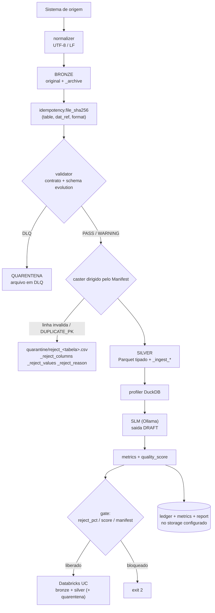

# Arquitetura — Projeto Nimbus

Este documento descreve a estrutura tecnica do pipeline, as decisoes de design que moldaram cada
componente e como eles se conectam. Para visao geral e instrucoes de uso, consulte o
[README](../README.md); para a camada de storage em detalhe, [STORAGE_S3.md](STORAGE_S3.md).

---

## 1. O fluxo de dados de ponta a ponta

O dado chega na landing zone no formato que o sistema de origem produz — CSV, JSON, Fixed-Width ou
SAS7BDAT. Antes de qualquer processamento, a normalizacao garante UTF-8 com terminadores LF,
independentemente do sistema que gerou o arquivo. Arquivos em EBCDIC sao detectados e sinalizados
para tratamento manual, sem travar o pipeline.

O arquivo entra na camada Bronze **como chegou** — o original fica preservado em `_archive/`, sem
cast e sem validacao. Em seguida vem a validacao de contrato: se o schema nao bate com o Manifest
(coluna obrigatoria removida, tipo incompativel), o arquivo e isolado na quarentena sem interromper
as demais tabelas; se a mudanca e nao-quebradora (coluna nova na origem), o pipeline avanca com
aviso e `evolution_type` registrado.

As tabelas aprovadas passam pelo cast dirigido pelo Manifest (linha a linha, com rejeito
individual), pelo profiling DuckDB e sao promovidas para Silver em Parquet tipado. Por fim, o score
de qualidade e as metricas sao calculados, o relatorio e consolidado e o gate decide se a
publicacao acontece.



**Limite importante e deliberado:** o gate bloqueia a **publicacao**, nao a escrita local na Silver.
Uma carga reprovada pode existir como Parquet em `data/processed/` antes do bloqueio; o consumidor
da Silver precisa filtrar por status da run (ha consultas prontas em
`queries_apresentacao.sql`).

---

## 2. Arquitetura Medallion

Sete camadas mapeadas em diretorios locais ou buckets S3, conforme o backend:

O **Bronze** e a landing zone — o dado bruto exatamente como chegou, com o original em `_archive/`.
O **Silver** recebe o que passou pela validacao e pelo cast, em Parquet tipado. O **Gold** esta
reservado e **nao tem fluxo funcional** nesta PoC — o medallion termina na Silver. A **Quarentena**
isola arquivos com breaking change e as linhas rejeitadas, preservando o valor original. Os
**Contracts** guardam os Manifests YAML. As **Metrics** guardam os JSONs por execucao e o ledger de
idempotencia. Os **Reports** reunem a documentacao gerada pela SLM e o relatorio consolidado.

---

## 3. A camada de Storage

`src/storage/storage.py` impede que o restante do pipeline saiba onde o dado reside. Todos os
modulos usam a mesma interface (`read`, `write`, `write_text`, `write_parquet`, `move`,
`promote_to_parquet`, `list`, `exists`, `read_path`), com ou sem object storage.

`LocalStorage` e o padrao, sem dependencia externa. `MinIOStorage` e ativado com `USE_MINIO=true` e
usa o client `minio`, que fala a API S3 — o mesmo backend atende MinIO, S3Mock e AWS S3, mudando
endpoint, TLS, regiao e prefixo de bucket por variavel de ambiente.

Uma decisao importante: `read()` detecta o formato pelo sufixo e usa o parser correto. Um `.json` e
lido via `json_normalize`; um `.txt` posicional via `read_fwf` usando os colspecs do sidecar
`.layout` gravado na escrita. Isso permite que cada formato percorra o pipeline sem tratamento
especial nos modulos downstream.

Detalhes de configuracao, receitas por backend, politica IAM de exemplo, armadilhas reais e o
status de evidencia de cada backend estao em [STORAGE_S3.md](STORAGE_S3.md).

---

## 4. Suporte multi-formato

O projeto trata dados bancarios como eles realmente chegam: CSV com semicolon de sistemas Windows,
JSON aninhado de APIs, arquivos posicionais de mainframe, SAS7BDAT do sistema de credito.

Para a geracao dos dados ficticios da PoC, cada formato tem um Writer (`CSVWriter`, `JSONWriter`,
`FixedWidthWriter`) que recebe um DataFrame e devolve `(filename, content)` — padrao Strategy. A
logica de dominio nunca sabe em qual formato o resultado sera gravado.

O `FixedWidthWriter` gera tambem o sidecar `.layout` com os colspecs exatos, lido depois pelo
storage. Sem esse sidecar, `read_fwf` precisaria inferir colunas por heuristica, o que introduziria
erro silencioso.

**Geracao deterministica.** Quando `--dat-ref` e informada, a semente vem de
`SHA-256(scenario|format|dat_ref)` e semeia `random`, NumPy, Faker e a geracao de UUID; a mesma
combinacao logica produz o mesmo arquivo byte a byte. Isso e o que torna o caso
`REPROCESS_IDENTICAL` demonstravel. Sem `--dat-ref`, a geracao permanece aleatoria.

---

## 5. Validacao e deteccao de schema evolution

`validator.py` compara o arquivo recebido com o contrato e classifica em tres categorias. O caminho
feliz retorna `PASS` ou `WARNING` (nulos acima da tolerancia, duplicatas dentro do limite). Um
breaking change — coluna obrigatoria removida, tipo incompativel — retorna `DLQ` e move o arquivo
para quarentena. Mudanca nao-quebradora retorna `WARNING` com o `evolution_type` registrado.

Manifest em `DRAFT` nao bloqueia por padrao, mas gera aviso em toda execucao enquanto nao for
promovido. Com `REQUIRE_VALIDATED_MANIFEST=true`, DRAFT passa a bloquear a publicacao (exit 2).

O cast e dirigido pelo contrato: cada coluna vai para o tipo declarado e cada linha que nao converte
e rejeitada individualmente, com valor original preservado. O percentual rejeitado e comparado com
`tolerance.max_reject_pct`: dentro do limite publica como `PASS_WITH_REJECTS`, acima do limite a
publicacao e bloqueada.

---

## 6. Profiling

O profiler usa DuckDB pela velocidade — sem servidor, sem overhead — com fallback para pandas
quando o DuckDB nao esta disponivel ou o formato nao e suportado diretamente.

Por coluna, gera: percentual de nulos, contagem de valores unicos, min, max e media para numericos,
e os cinco valores mais frequentes para categoricos. Essas estatisticas sao o que a SLM recebe junto
com o Manifest.

---

## 7. Idempotencia e reprocessamento

A identidade logica da carga e `(tabela, dat_ref, formato)`. O `run_id` identifica a execucao e
serve para linhagem; a `dat_ref` identifica a janela de dados e e a chave de sobrescrita da
particao.

`src/ingestion/idempotency.py` calcula o SHA-256 do arquivo de entrada (blocos de 1 MiB) e mantem o
ledger `metrics/_ingest_ledger.json` no storage configurado. Estados:

| Estado | Condicao | Efeito |
|---|---|---|
| `FIRST_LOAD` | sem entrada anterior | processa |
| `REPROCESS_IDENTICAL` | mesmo `(tabela, dat_ref, formato)` e mesmo hash | declara reprocessamento; `--skip-existing` pode pular |
| `REPROCESS_MODIFIED` | mesma chave, hash diferente | loga `ENTRADA DIVERGENTE`, guarda `previous_sha256`, **ignora** `--skip-existing` |

Cada entrada registra `input_file`, `input_sha256`, `previous_sha256`, `input_situation`,
`reprocess_count`, `status`, `rows`, `run_id`, `dat_ref` e `format`. Carga bloqueada por gate/DLQ
fica como `BLOCKED` e nunca e pulada. Entradas antigas sem hash sao tratadas como identicas, por
compatibilidade.

Limites operacionais desta implementacao, ditos de frente: o ledger e um JSON reescrito (nao
transacional), nao existe lock nem estado `RUNNING`, e publicacao e ledger nao sao atomicos. E
adequado a execucao sequencial, que e como o pipeline roda.

---

## 8. Orquestracao

Dois modos de execucao com a mesma logica de negocio. `run_pipeline.py` e execucao direta, sem
orquestrador. `prefect_flow.py` e a mesma pipeline decorada com `@task`/`@flow` do Prefect 3.x, com
cada task mapeada para um job Control-M e exit codes padronizados.

| Task Prefect | Job Control-M | Exit codes |
|---|---|---|
| `task_extract_manifest` | JOB-DM-000-EXTRACT (opcional) | 0=OK, 1=SKIPPED, 2=ERROR |
| `task_generate_data` | JOB-DM-001-GENERATE | 0=OK, 2=ERROR |
| `task_validate` | JOB-DM-002-VALIDATE | 0=PASS, 1=WARNING, 2=DLQ |
| `task_profile` | JOB-DM-003-PROFILE | 0=OK, 2=ERROR |
| `task_enrich_slm` | JOB-DM-004-ENRICH | 0=OK, 1=SKIPPED, 2=ERROR |
| `task_collect_metrics` | JOB-DM-005-METRICS | 0=OK |
| `task_report` | JOB-DM-006-REPORT | 0=OK |

Quando o gate de qualidade, a governanca ou a quarentena barram a publicacao, o flow levanta
`GateBlocked`: a run aparece como **Failed** no Prefect (UI, worker e deployment) e a CLI termina com
exit code 2 — bloqueio esperado, distinto do exit 1 de erro inesperado.

O modo `--no-prefect` troca flow e tasks pelas funcoes puras (`.fn`), nao registra nada no servidor
Prefect e nao sobe servidor efemero, preservando os mesmos exit codes:

```bash
python prefect_flow.py --no-prefect --scenario baseline --run-id %%JOBRUNID%%
```

A publicacao no Databricks (Bronze, Silver e quarentena) acontece nos dois runners.

---

## 9. Metricas e quality score

A cada execucao, `quality_score.py` calcula um score de 0 a 100 por tabela combinando quatro
dimensoes: conformidade de tipos contra o Manifest (40%), completude em relacao a tolerancia de nulo
do contrato (25%), unicidade da chave primaria (20%) e estabilidade de schema (15%). Dimensao nao
mensuravel recebe `None` e o peso e renormalizado entre as dimensoes efetivamente medidas — o score
nunca penaliza o que nao pode ser avaliado.

`metrics_collector.py` grava os registros pelo storage configurado — `data/metrics/` e
`data/reports/` no backend local, buckets `nimbus-metrics` e `nimbus-reports` com `USE_MINIO=true` —
e `python show_metrics.py` le do mesmo backend, sem depender do filesystem.

---

## 10. SLM e revisao humana

`src/slm/` conversa com o Ollama local (padrao `phi4`). O modelo recebe o Manifest e as estatisticas
reais do profiling e propoe descricoes; a saida nasce marcada `[AI_METADATA_STATUS: DRAFT]` e o
Manifest so avanca para `VALIDATED` por acao do Data Steward. Ausencia do servico nao derruba o
pipeline: o status vai para `SKIPPED` e a execucao segue.

O Ollama serializa inferencias por padrao (`OLLAMA_NUM_PARALLEL=1`), e o pipeline roda sequencial
por escolha: a inferencia domina o tempo de parede, e paralelizar significaria multiplos contextos
do modelo em memoria e logs intercalados — ruim para a rastreabilidade que o projeto vende.

Limite: a marcacao de dado sensivel e heuristica sobre nome de coluna, e a mascara do prompt so
atua sobre coluna marcada. Nomes legados (`NRDOC`, `DDD_FONE`, `LOGRAD`) podem nao ser reconhecidos.
SLM local nao substitui governanca corporativa de IA.

---

## 11. Integracao com Databricks — Bronze e Silver no Unity Catalog

`src/connectors/databricks_uploader.py` e `src/connectors/bronze_uploader.py` integram o pipeline
via REST API, sem cluster Spark. O catalog padrao e `nimbus`, com schemas por camada:
`nimbus.bronze` (arquivo bruto) e `nimbus.silver` (Parquet tipado).

**Por que Volumes e nao DBFS.** O root do DBFS esta bloqueado por padrao em workspaces novos
(`PERMISSION_DENIED: Public DBFS root is disabled`). Os Volumes do Unity Catalog sao o substituto
oficial — ACL propria, versionaveis e visiveis no catalogo como objetos de primeira classe.

**Pre-requisito no SQL Editor (uma vez):**

```sql
CREATE SCHEMA IF NOT EXISTS nimbus.bronze;
CREATE SCHEMA IF NOT EXISTS nimbus.silver;
CREATE VOLUME IF NOT EXISTS nimbus.bronze.landing;
CREATE VOLUME IF NOT EXISTS nimbus.silver.landing;
```

**Fluxo Bronze por execucao.** O arquivo da landing zone e enviado via Files API preservando o nome
original: `/Volumes/nimbus/bronze/landing/<tabela>/dat_ref=YYYY-MM-DD/<arquivo>`. O registro usa
CTAS com `inferColumnTypes => false` — todas as colunas de negocio ficam STRING — e acrescenta
`_ingest_file`, `_ingest_time` e `_ingest_run_id`. Tags `nimbus_layer=bronze` e `validated=false`
deixam explicito que a tabela nao passou pelo gate. Formatos sem `read_files` (sidecar `.layout`)
sobem so o arquivo.

**Fluxo Silver por execucao.** O Parquet vai via Files API em um unico
`PUT /api/2.0/fs/files/<volume-path>?overwrite=true`, com particionamento Hive por data:
`/Volumes/nimbus/silver/landing/<tabela>/dat_ref=YYYY-MM-DD/part-YYYY-MM-DD.parquet`.

```sql
CREATE OR REPLACE TABLE nimbus.silver.tb_clientes
AS SELECT * FROM read_files(
  '/Volumes/nimbus/silver/landing/tb_clientes',
  format => 'parquet'
)
```

Isso cria uma managed Delta table lendo o Volume como fonte — sem `CONVERT TO DELTA`, sem external
location. Tags e comentarios vem do Manifest via `COMMENT ON TABLE`, `ALTER TABLE SET TAGS` e
`ALTER COLUMN SET TAGS`; as `regulatory_flags` (LGPD, SCR) aparecem como tags pesquisaveis no Unity
Catalog.

`publish_bronze()` e `publish_table()` sao as interfaces do pipeline. Cada uma devolve
`{table, status, target, error}` e nunca levanta excecao.

**Atencao de governanca:** `DATABRICKS_QUARANTINE_UPLOAD` vem `true` por padrao, e os rejeitos
preservam o valor original — inclusive PII em claro. Em ambiente com dado real, avalie desligar ou
mascarar antes de publicar a quarentena.

| Variavel | Exemplo | Descricao |
|---|---|---|
| `DATABRICKS_HOST` | `https://adb-1234.azuredatabricks.net` | URL do workspace |
| `DATABRICKS_TOKEN` | `dapi...` | PAT (ou vazio para OAuth) |
| `DATABRICKS_WAREHOUSE_ID` | `abc123` | SQL Editor > copy ID |
| `DATABRICKS_CATALOG` | `nimbus` | Catalog UC |
| `DATABRICKS_SILVER_SCHEMA` | `silver` | Schema Silver |
| `DATABRICKS_BRONZE_SCHEMA` | `bronze` | Schema Bronze |
| `DATABRICKS_VOLUME` | `landing` | Volume Silver |
| `DATABRICKS_BRONZE_VOLUME` | `landing` | Volume Bronze |
| `DATABRICKS_AUTO_UPLOAD` | `true` | Publica Silver no fim do run |
| `DATABRICKS_BRONZE_UPLOAD` | `true` | Publica Bronze apos a geracao |
| `DATABRICKS_QUARANTINE_UPLOAD` | `true` | Publica rejeitos e DLQ |

```bash
python tasks.py test-databricks          # diagnostico em 4 niveis
python tasks.py upload-bronze            # arquivo bruto
python tasks.py upload-silver --dry-run  # valida sem enviar dados
python tasks.py upload-silver            # Parquet + Delta + tags
```

A integracao Databricks e coberta por 91 testes com mock total (`test_databricks.py`,
`test_bronze.py`). Execucao em workspace real nao esta evidenciada nesta branch.
