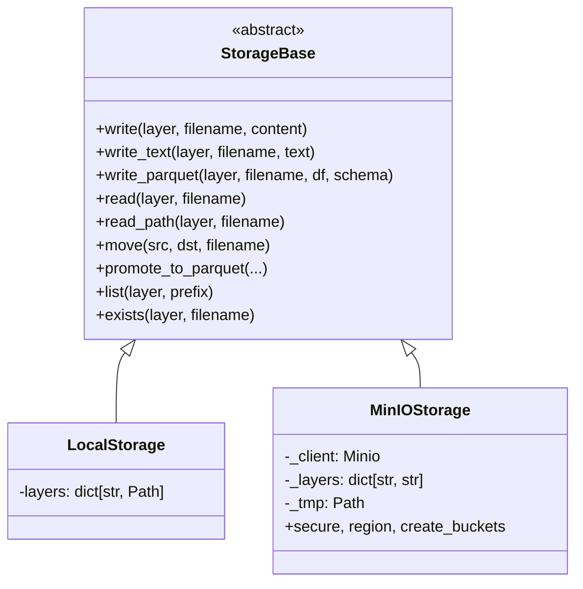

# Storage portavel — filesystem, MinIO, S3 e AWS

Este documento detalha a camada de storage do Nimbus: a abstracao, os backends, como configurar
cada um, o que foi efetivamente exercitado nesta branch e o que falta para uma conta AWS real.
Para a visao geral, veja o [README](../README.md#6-storage-portavel-local-minio-e-s3).

---

## 1. A abstracao

`src/storage/storage.py` define `StorageBase` e duas implementacoes. Nenhum modulo do pipeline
conhece o backend: todos falam a mesma interface.

| Metodo | Responsabilidade |
|---|---|
| `write(layer, filename, content)` | grava conteudo bruto em uma camada |
| `write_text(layer, filename, text)` | grava texto (metricas, relatorio, ledger) |
| `write_parquet(layer, filename, df, schema)` | grava Parquet com schema do Manifest |
| `read(layer, filename)` | le para DataFrame, escolhendo o parser pelo sufixo |
| `read_path(layer, filename)` | caminho local utilizavel (baixa do bucket quando necessario) |
| `move(src_layer, dst_layer, filename)` | move entre camadas (quarentena/DLQ) |
| `promote_to_parquet(...)` | Bronze tipado -> Silver |
| `list(layer, prefix)` | lista objetos de uma camada |
| `exists(layer, filename)` | existencia de objeto |

As camadas sao `bronze`, `silver`, `gold`, `quarantine`, `contracts`, `metrics` e `reports`.
`get_storage()` e a fabrica: le `USE_MINIO` e devolve `LocalStorage` ou `MinIOStorage`.



O `LocalStorage` nao tem dependencia externa. O `MinIOStorage` usa o client `minio`, que implementa
a API S3 — por isso o mesmo codigo atende MinIO, S3Mock e S3.

---

## 2. Mapa de camadas por backend

| Camada | `LocalStorage` | `MinIOStorage` (`BUCKET_PREFIX=nimbus`) |
|---|---|---|
| bronze | `data/bronze/` (+ `_archive/`) | `nimbus-bronze` |
| silver | `data/processed/` | `nimbus-silver` |
| quarantine | `data/quarantine/` | `nimbus-quarantine` |
| contracts | `contracts/` | `nimbus-contracts` |
| metrics | `data/metrics/` | `nimbus-metrics` |
| reports | `data/reports/` | `nimbus-reports` |

Metricas, relatorio consolidado e o ledger de idempotencia (`_ingest_ledger.json`) vao para o
**mesmo backend do dado**. Isso evita a incoerencia de publicar o dado em object storage e deixar a
governanca presa no disco da maquina que rodou o pipeline.

---

## 3. Configuracao por variavel de ambiente

| Variavel | Padrao | Efeito |
|---|---|---|
| `USE_MINIO` | `false` | seleciona o backend |
| `MINIO_ENDPOINT` | `localhost:9000` | `host:porta` **sem** esquema (`http://` quebra o client) |
| `MINIO_ACCESS_KEY` | (vazio) | access key — **obrigatoria** com `USE_MINIO=true`; `get_storage()` levanta `RuntimeError` se vazia |
| `MINIO_SECRET_KEY` | (vazio) | secret key — **obrigatoria** com `USE_MINIO=true` |
| `MINIO_SECURE` | `false` | `true` = HTTPS/TLS |
| `MINIO_REGION` | (vazio) | regiao na assinatura SigV4 |
| `BUCKET_PREFIX` | `nimbus` | prefixo dos buckets |
| `MINIO_CREATE_BUCKETS` | `true` | `false` = nao cria bucket, falha se faltar |

---

## 4. Receitas

### 4.1 Filesystem local (padrao, nada a instalar)

```bash
python run_pipeline.py --scenario baseline --format csv
python show_metrics.py --score
```

### 4.2 MinIO local

Caminho de um comando (`scripts/nimbus_up.py`, idempotente):

```bash
make up      # gera o .env na 1a vez, sobe o minio, espera health check, cria os buckets
make demo    # o mesmo + pipeline e score rodando contra o MinIO, sem export manual
```

O bootstrap **nunca sobrescreve** credencial existente: reexecutar reaproveita o `.env`, e a
credencial e gerada com `secrets.token_urlsafe`, gravada com permissao `0600` e nunca impressa
(consulte com `make minio-creds`). `make reset-minio` derruba containers e volume e recria.

Equivalente na mao, quando se quer ver cada etapa:

```bash
# credencial obrigatoria: nao existe default no compose nem no config.py
cp .env.example .env
printf 'MINIO_ACCESS_KEY=%s\nMINIO_SECRET_KEY=%s\n' "$(openssl rand -hex 12)" "$(openssl rand -hex 24)" >> .env
set -a && . ./.env && set +a

docker compose up -d minio     # falha rapido se MINIO_ACCESS_KEY/SECRET_KEY nao estiverem no .env

export USE_MINIO=true
export MINIO_ENDPOINT=localhost:9000

python run_pipeline.py --scenario baseline --format json
python show_metrics.py --score        # le de nimbus-metrics
```

Trocar a credencial no `.env` com o ambiente ja de pe **nao** exige apagar o volume: o
`docker compose up -d` recria o container com as novas `MINIO_ROOT_USER`/`MINIO_ROOT_PASSWORD`
(root credential do MinIO vem do ambiente, nao do volume). Usuarios criados via console e
politicas, sim, vivem no volume.

UI em `http://localhost:9001` — util para mostrar os buckets sendo populados ao vivo.

### 4.3 Segundo servidor S3-compativel, com TLS, regiao e prefixo

Exercitado nesta branch com **Adobe S3Mock** (implementacao diferente do MinIO), alterando somente
variaveis de ambiente — nenhuma linha de `storage.py`:

```bash
export USE_MINIO=true
export MINIO_ENDPOINT=localhost:9191
export MINIO_SECURE=true
export MINIO_REGION=us-east-1
export BUCKET_PREFIX=nimbus-tls2
export MINIO_ACCESS_KEY=dummy
export MINIO_SECRET_KEY=dummy

python run_pipeline.py --scenario baseline --format csv
```

### 4.4 AWS S3

```bash
export USE_MINIO=true
export MINIO_ENDPOINT=s3.sa-east-1.amazonaws.com
export MINIO_SECURE=true
export MINIO_REGION=sa-east-1
export BUCKET_PREFIX=nimbus-<sufixo-unico>
export MINIO_CREATE_BUCKETS=false
export MINIO_ACCESS_KEY=<AWS_ACCESS_KEY_ID>
export MINIO_SECRET_KEY=<AWS_SECRET_ACCESS_KEY>

python run_pipeline.py --scenario baseline --format csv
```

Buckets esperados (criados fora do pipeline, por IaC ou pela plataforma):

```
nimbus-<sufixo>-bronze
nimbus-<sufixo>-silver
nimbus-<sufixo>-quarantine
nimbus-<sufixo>-contracts
nimbus-<sufixo>-metrics
nimbus-<sufixo>-reports
```

Politica IAM minima para a credencial do pipeline (escopo restrito ao prefixo):

```json
{
  "Version": "2012-10-17",
  "Statement": [
    {
      "Effect": "Allow",
      "Action": ["s3:ListBucket", "s3:GetBucketLocation"],
      "Resource": "arn:aws:s3:::nimbus-<sufixo>-*"
    },
    {
      "Effect": "Allow",
      "Action": ["s3:GetObject", "s3:PutObject", "s3:DeleteObject"],
      "Resource": "arn:aws:s3:::nimbus-<sufixo>-*/*"
    }
  ]
}
```

---

## 5. Armadilhas reais (todas reproduzidas durante a validacao)

1. **TLS obrigatorio.** Sem `MINIO_SECURE=true`, o client falha com
   `This combination of host and port requires TLS`. S3 gerenciado nao atende HTTP.
2. **Regiao.** Endpoint regional exige `MINIO_REGION` para a assinatura SigV4.
3. **Nome de bucket em S3 e global.** `nimbus-bronze` tende a existir na conta de outra pessoa;
   sem `BUCKET_PREFIX` proprio a criacao falha ou colide.
4. **Esquema no endpoint.** `MINIO_ENDPOINT` recebe `host:porta`; incluir `https://` quebra.
5. **Criacao de bucket em nuvem.** Com `MINIO_CREATE_BUCKETS=true` o pipeline criaria bucket
   sozinho na conta. Em nuvem, use `false` — o erro passa a ser explicito
   (`RuntimeError` citando o bucket ausente).
6. **Credencial em maquina de demonstracao.** Chave AWS em `.env` local e risco desproporcional
   para a apresentacao. Nao ha credencial default em nenhum lugar do projeto: o compose usa
   `${MINIO_ACCESS_KEY:?...}` e o `config.py` deixa a variavel vazia, entao a credencial local
   e gerada por quem sobe o ambiente e vive somente no `.env` (fora do Git).

---

## 6. Status de evidencia

| Backend | Situacao | Observacao |
|---|---|---|
| `LocalStorage` | exercitado | cenarios baseline, `type_drift`, `breaking`, 3 formatos |
| MinIO local (HTTP) | exercitado | 3 formatos, metricas e relatorios nos buckets |
| Adobe S3Mock (HTTPS + regiao + prefixo) | exercitado | mesma execucao, so env var trocada |
| `MINIO_CREATE_BUCKETS=false` | exercitado | erro explicito em bucket inexistente |
| AWS S3 | **nao exercitado** | compatibilidade por API; falta conta, IAM, nome unico e custo |
| ADLS Gen2 | **nao exercitado** | ver [MIGRATION_PLAN.md](MIGRATION_PLAN.md) |

A frase defensavel e: *"o backend e portavel e foi provado em duas implementacoes S3 distintas,
inclusive com TLS e regiao; o que falta para AWS e conta e IAM, nao codigo"*. Afirmar validacao em
AWS sem ter rodado em AWS e exatamente o tipo de hipotese que uma banca derruba com uma pergunta.

---

## 7. Cobertura de teste

`tests/test_minio_storage.py` (20 testes) exercita `MinIOStorage` contra um duplo de teste em
memoria, cobrindo criacao de buckets, `MINIO_CREATE_BUCKETS=false`, prefixo, TLS, regiao,
`write`/`read`/`write_text`/`write_parquet`/`move`/`promote_to_parquet`, `list`, `exists`,
arquivamento, colunas de linhagem, selecao de backend em `get_storage()` e paridade de interface
com `LocalStorage`. `tests/test_storage.py` (31 testes) cobre o `LocalStorage` com diretorio
temporario real.
